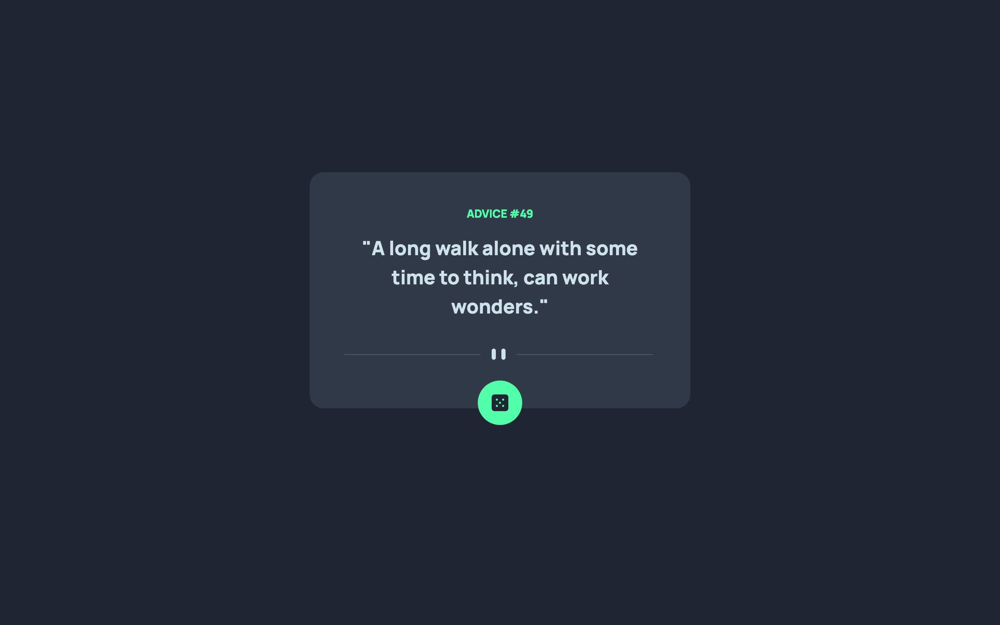
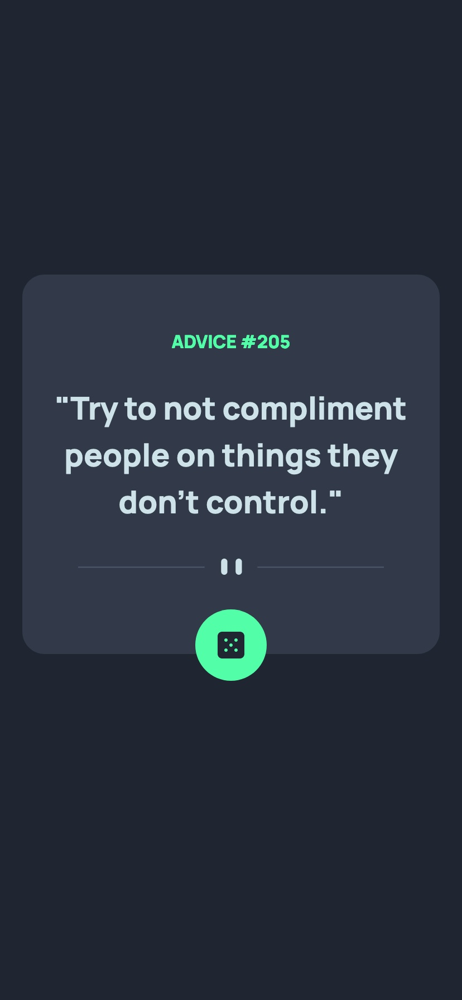

# Frontend Mentor - Advice generator app solution

This is a solution to the [Advice generator app challenge on Frontend Mentor](https://www.frontendmentor.io/challenges/advice-generator-app-QdUG-13db). Frontend Mentor challenges help you improve your coding skills by building realistic projects.

## Table of contents

- [Overview](#overview)
  - [The challenge](#the-challenge)
  - [Screenshot](#screenshot)
  - [Links](#links)
- [My process](#my-process)
  - [Built with](#built-with)
  - [What I learned](#what-i-learned)
  - [Continued development](#continued-development)
  - [Useful resources](#useful-resources)
- [Author](#author)

## Overview

### The challenge

Users should be able to:

- View the optimal layout for the app depending on their device's screen size
- See hover states for all interactive elements on the page
- Generate a new piece of advice by clicking the dice icon

### Screenshot




### Links

- Solution URL: [Add solution URL here](https://your-solution-url.com)
- Live Site URL: [Add live site URL here](https://your-live-site-url.com)

## My process

### Built with

- HTML5 markup
- CSS custom properties
- Flexbox
- Mobile-first workflow

### What I learned

```html
<picture>
	<source
		srcset="./images/pattern-divider-mobile.svg"
		media="(max-width:480px)" />
	<source
		srcset="./images/pattern-divider-desktop.svg"
		media="(min-width:1440px)" />
	
</picture>
```

```css
.imageContainer {
	background-color: v.$neoGreen;
	border-radius: 50%;
	position: relative;
	bottom: 40px;
}
```

```js
const apiEndPoint = async () => {};
```

### Continued development

- Javascript Application Programming Interface
- Javascript Json
- Javascript Asynchronous

### Useful resources

- [How to use HTML 5 picture](https://webdesign.tutsplus.com/quick-tip-how-to-use-html5-picture-for-responsive-images--cms-21015t) - The examples in this article helped me to understand how to use the scret and sizes for responsive images.

## Author

- Frontend Mentor - [@mayor-creator](https://www.frontendmentor.io/profile/mayor-creator)
